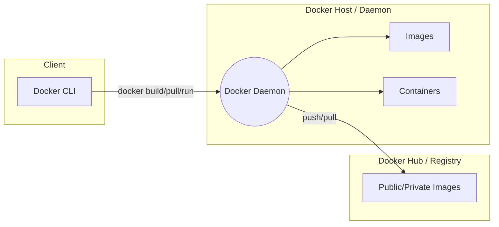
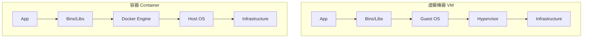

# 第 0 章：Docker 基礎概念與環境搭建

## 觀念講解 (Concepts)

### 什麼是 Docker？
Docker 是一個開源平台，用於開發、運送和執行應用程式。它讓你能將應用程式與基礎設施分開，從而實現快速交付。

### 容器 (Container) vs. 虛擬機器 (VM)
- **虛擬機器 (VM)**：在硬體層之上運行 Hypervisor，每個 VM 都包含完整的作業系統 (Guest OS)，啟動慢且佔用資源多。
- **容器 (Container)**：在作業系統層（Docker Engine）之上運行，共用主機的作業系統內核 (Kernel)，輕量且啟動速度極快。

### Docker 核心架構圖
透過 Mermaid 架構圖理解 Client-Server 模型：



#### 關係連結說明 (Link Meanings)
*   **A → B (Client 到 Daemon)**：這是**指令傳遞**。使用者透過 CLI 輸入命令，將操作請求發送給後端 Daemon 執行。
*   **B → C (Daemon 到 Images)**：這是**資源管理**。Daemon 負責下載、儲存與索引映像檔，確保映像檔在本地可用。
*   **B → D (Daemon 到 Containers)**：這是**生命週期控制**。Daemon 負責容器的啟動、停止、暫停與刪除，並監控其運作狀態。
*   **B ↔ E (Daemon 與 Registry)**：這是**遠端同步**。Daemon 根據指令從 Registry 下載 (Pull) 映像檔，或將本地映像檔上傳 (Push) 至雲端分享。

### 容器 (Container) vs. 虛擬機器 (VM)


#### 分層連結說明 (Layered Link Meanings)
*   **App → Bins/Libs**：**程式依賴性**。應用程式運行所需的特定函式庫。
*   **Bins/Libs → Guest OS / Engine**：**系統交互層**。在 VM 中，程式需透過完整的 OS 核心運作；而在容器中，則是透過 Docker Engine 直接與主機內核通訊。
*   **Engine → Host OS**：**核心共享**。這是容器輕量化的關鍵，連結代表容器直接利用 Host OS 的系統資源，而非重新模擬。
*   **OS → HW (基礎設施)**：**資源分配**。最終將邏輯運算交由底層硬體 (CPU/RAM/Disk) 處理。

### Docker 的核心組件
1.  **Image (映像檔)**：唯讀的範本，包含了運行程式所需的代碼、函式庫、環境變數和配置文件。
2.  **Container (容器)**：映像檔的運行實例。
3.  **Docker Hub / Registry**：存放映像檔的地方。

### 角色意義與關係運作 (Roles & Workflow)

為了更深入理解 Docker，我們需要拆解架構圖中各個角色的意義以及它們是如何互動的：

#### 1. Client (客戶端)
- **角色**：Docker 的操作介面。
- **意義**：這是使用者與 Docker 互動的窗口。當你輸入 `docker build` 或 `docker run` 時，你其實是在跟 Client 說話，它會將你的指令發送給 Docker Daemon。

#### 2. Host / Daemon (伺服器端)
- **角色**：Docker 的大腦與核心引擎。
- **意義**：Docker Daemon (dockerd) 負責處理複雜的工作，包括管理 Images、Containers、Networks 與 Volumes。它才是真正執行「建立、運行、分發」動作的角色。

#### 3. Registry (註冊中心)
- **角色**：映像檔的圖書館/倉庫。
- **意義**：預設是 **Docker Hub**。它存放著成千上萬的映像檔，讓開發者可以輕鬆地分享與下載環境。

#### 4. 三位一體的運作流程
- **Build (建立)**：Client 指令告訴 Daemon，請根據 Dockerfile 的規則，把源碼包裝成一個 Image。
- **Pull (下載)**：Daemon 發現本地沒有某個 Image，會主動去 Registry 下載回來。
- **Run (執行)**：Daemon 把唯讀的 Image 拿出來，在上面加一層寫入層，變成一個活生生的 Container 在運作。

---

## 實作演練 (Implementation)

### 1. 環境安裝
請根據你的作業系統下載並安裝 Docker Desktop：
- [Windows/Mac 下載連結](https://www.docker.com/products/docker-desktop/)
- Linux 使用者請參考 [Official Installation Guide](https://docs.docker.com/engine/install/)

### 2. 驗證安裝
安裝完成後，打開終端機 (Terminal / PowerShell) 輸入以下指令：

```bash
# 檢查 Docker 版本
docker --version

# 運行你的第一個容器 (Hello World)
docker run hello-world
```

**預期結果**：
如果你看到 "Hello from Docker!" 的字樣，恭喜你，Docker 環境已經成功搭建完成！

---
*Last updated: 2026-03-13 by SiaSia 🦞*
