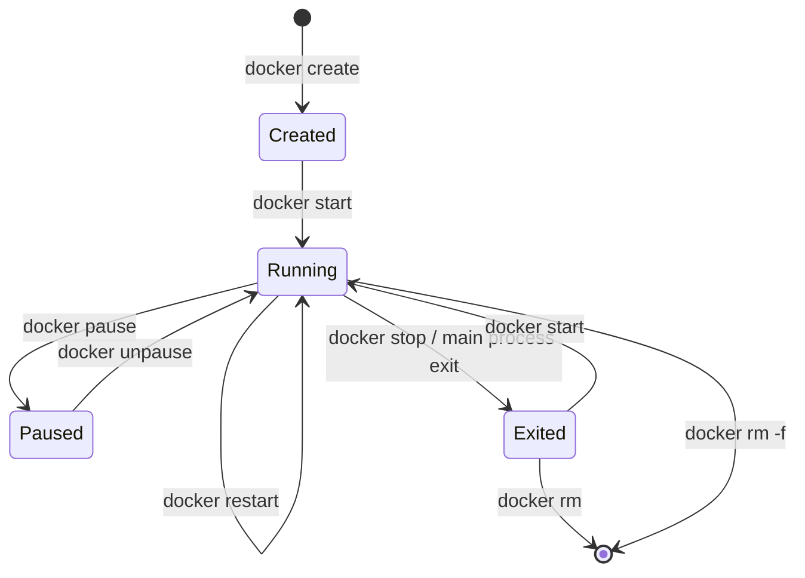

# 第 1 章：常用指令介紹

## 觀念講解 (Concepts)

### 容器的生命週期 (Lifecycle)
理解 Docker 指令最好的方式是了解容器的狀態變化：



#### 狀態轉換說明 (Transition Meanings)
*   **[*] → Created**：**靜態配置**。僅分配檔案系統，尚未分配計算資源 (CPU/Memory)。
*   **Created / Exited → Running**：**運算激活**。正式配置系統資源，並啟動容器內部的 entrypoint 進程。
*   **Running → Paused**：**狀態掛起**。利用 cgroups 的 freezer 功能凍結所有進程，CPU 使用率降至零，但保留內存快照。
*   **Running → Exited**：**資源回收**。進程結束或被主動停止，釋放 CPU/Memory，但保留可寫層的檔案變動。
*   **Exited → [*]**：**完全銷毀**。移除容器的檔案系統，這是不可逆的操作。

### 狀態與指令的關聯 (States & Commands)

在生命週期圖中，每一條線都代表一個 **指令的角色**，負責將容器推向不同的狀態：

1.  **docker create**：僅在磁碟上建立容器的容器層（Container Layer），但不分配 CPU/Memory，狀態為 `Created`。
2.  **docker start**：將已建立的容器啟動，分配系統資源，正式進入 `Running` 狀態。
3.  **docker run**：這是最常用的組合技，等於先執行 `create` 再執行 `start`。
4.  **docker stop**：溫柔地（優雅地）停止容器。它會先發送 `SIGTERM` 訊號給容器內的主進程，讓程式有時間存檔或關閉連線，若超時則發送 `SIGKILL`。
5.  **docker kill**：粗暴地停止。直接發送 `SIGKILL`，適用於容器卡死無法回應時。
6.  **docker rm**：這是清理的最後一步。只有處於 `Exited` 狀態的容器才能被移除，除非使用 `-f` 強制移除。

### 指令結構的意義
現代 Docker 指令通常遵循 `docker <object> <command>` 的模式，例如 `docker container run`，但傳統的簡化形式 `docker run` 依然被廣泛使用。
- **Object (對象)**：明確告知你要操作的是 `image`, `container`, `network` 還是 `volume`。
- **Command (命令)**：你要對該對象做的動作，如 `ls`, `rm`, `inspect`。

---

## 實作演練 (Implementation)

### 1. 映像檔操作 (Images)
在執行容器前，我們通常需要下載映像檔：

```bash
# 搜尋映像檔 (以 nginx 為例)
docker search nginx

# 下載映像檔
docker pull nginx

# 列出本地所有映像檔
docker images
```

### 2. 容器生命週期操作 (Containers)
這是最常用的部分：

```bash
# 啟動並執行一個容器 (背景執行 -d, 命名 --name)
docker run -d --name my-nginx -p 8080:80 nginx

# 列出正在執行的容器
docker ps

# 列出所有容器 (包含已停止的)
docker ps -a

# 查看容器日誌
docker logs my-nginx

# 停止容器
docker stop my-nginx

# 啟動已存在的容器
docker start my-nginx

# 移除容器 (須先停止)
docker rm my-nginx
```

### 3. 清理指令
當你練習完後，可以使用以下指令保持環境整潔：

```bash
# 移除映像檔
docker rmi nginx

# 強制移除正在執行的容器
docker rm -f my-nginx

# 清理所有未使用的資源 (慎用！)
docker system prune
```

---
*Last updated: 2026-03-13 by SiaSia 🦞*
