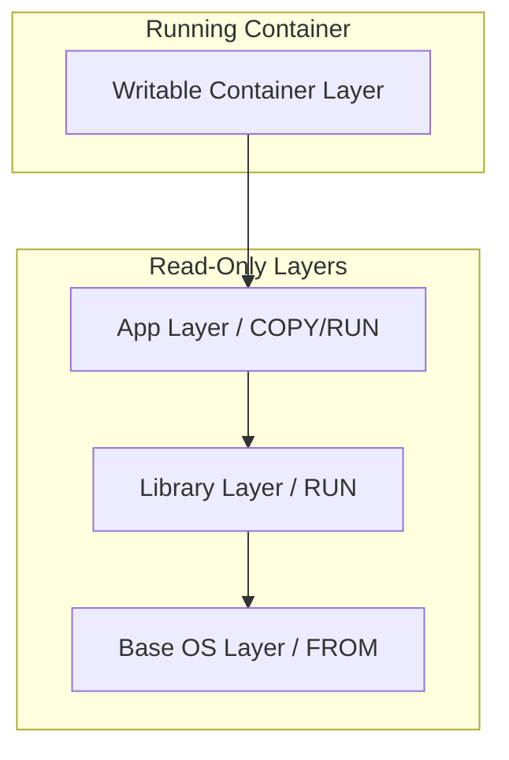
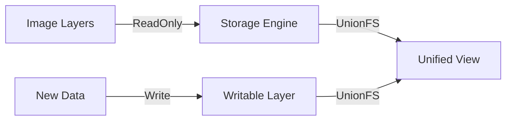

# 第 2 章：映像檔 (Image) 與容器 (Container)

## 觀念講解 (Concepts)

### 1. 映像檔分層架構 (Layered Architecture)
Docker 映像檔並非單一的大文件，而是由多個**唯讀層 (Read-only Layers)** 組成的。



#### 分層連結說明 (Layered Link Meanings)
*   **W → L3 (Writable to Image)**：**寫時複製 (Copy-on-Write)**。連結代表容器層會讀取映像檔層的資料；若要修改，會先將資料複製到 W 層再進行。
*   **L3 → L2 → L1 (層與層之間)**：**繼承與依賴 (Inheritance)**。每一層都僅紀錄相對於上一層的「增量」變動，形成一條不可變的依賴鏈。

### 2. 容器寫入層 (Writable Layer)
當你從映像檔啟動容器時，Docker 會在最頂端添加一個薄薄的**可寫層 (Writable Layer / Container Layer)**。



#### 資料流向說明 (Data Flow Meanings)
*   **A → B (Image 到 Engine)**：**底層讀取**。Storage Engine 從唯讀層獲取原始檔案內容。
*   **C → D (新資料到 Writable)**：**狀態紀錄**。所有容器運行期間產生的檔案異動（Log、暫存檔）都僅存在於此。
*   **B & D → E (合併檢視)**：**聯合掛載 (Union Mount)**。這是最關鍵的連結，它將多個物理層在邏輯上合併，讓應用程式看到的是一個完整的檔案系統。

- **唯讀層 (Read-Only)**：底下的映像檔分層絕不會被修改，這保證了映像檔的原始性。
- **可寫層 (Writable)**：容器啟動後的所有操作（新增檔案、修改配置）都發生在此。
- **寫時複製 (Copy-on-Write, CoW)**：如果你要修改底層 Image 的檔案，Docker 會先將該檔案從唯讀層「複製」到可寫層再讓你修改。這避免了修改 Image 內容。
- 當容器被刪除時，可寫層也會隨之消失。這就是為什麼容器是**無狀態的 (Stateless)**，持久化資料需要使用 **Volumes (卷期)** 或 **Bind Mounts**。

### 3. Union File System (UnionFS)
Docker 使用 UnionFS 技術將這些唯讀層與最頂端的可寫層合併，讓容器內部的程式感覺像是在一個完整的、可寫的文件系統上運行。

---

## 實作演練 (Implementation)

### 1. 檢視映像檔分層
透過指令了解映像檔背後的組成細節：

```bash
# 查看映像檔的歷史分層資訊
docker history nginx

# 查看映像檔的詳細中繼資料 (JSON 格式)
docker inspect nginx
```

### 2. 從容器建立映像檔 (Commit)
*雖然不建議手動 commit (建議用 Dockerfile)，但這是理解映像檔生成過程的好方法：*

```bash
# 1. 啟動一個 ubuntu 容器並進入
docker run -it --name test-ubuntu ubuntu bash

# 2. 在容器內做些修改 (例如安裝 git)
apt update && apt install -y git
exit

# 3. 將修改後的容器儲存為新的映像檔
docker commit test-ubuntu my-ubuntu-with-git:v1

# 4. 驗證新映像檔
docker images | grep my-ubuntu
```

### 3. 匯入與匯出映像檔
在沒有 Registry (如 Docker Hub) 的環境下，可以用檔案傳輸映像檔：

```bash
# 匯出為 tar 檔 (Save)
docker save -o my-ubuntu-v1.tar my-ubuntu-with-git:v1

# 從 tar 檔載入 (Load)
docker load -i my-ubuntu-v1.tar
```

---
*Last updated: 2026-03-13 by SiaSia 🦞*
