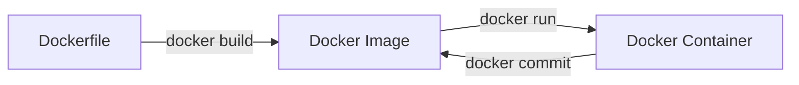

# 第 3 章：Dockerfile 實戰

## 觀念講解 (Concepts)

### 什麼是 Dockerfile？
Dockerfile 是一個純文字檔案，裡面包含了一系列的指令，用來自動化建立 Docker 映像檔。



#### 流程連結說明 (Workflow Meanings)
*   **A → B (Dockerfile 到 Image)**：**建構過程 (Building)**。Docker 讀取每一行指令並將其轉換成一個個唯讀的映像檔層。
*   **B → C (Image 到 Container)**：**實例化 (Instantiation)**。從唯讀範本中分支出一個具備寫入層的活體容器。
*   **C → B (Container 到 Image)**：**快照過程 (Snapshotting)**。雖然不常用，但 `commit` 指令能將容器的可寫層內容捕捉，並轉換成新的一個映像檔層（通常用於快速保存開發中的臨時環境）。

- **不可變性 (Immutability)**：Dockerfile 是映像檔的源代碼，確保了從代碼到運行的可重複性。
- **宣告式配置 (Declarative Configuration)**：你只需定義所需的環境與依賴，Docker Engine 會幫你生成映像檔。

### 常用的指令
- **FROM**：指定基礎映像檔。所有 Dockerfile 都必須以 FROM 開頭。
- **WORKDIR**：設定工作目錄 (相當於 cd)。
- **COPY / ADD**：將本地檔案複製到容器中。
- **RUN**：在建立映像檔期間執行的命令 (例如安裝套件)。
- **CMD / ENTRYPOINT**：容器啟動後執行的預設命令。
- **EXPOSE**：宣告容器監聽的通訊埠 (Port)。
- **ENV**：設定環境變數。

---

## 實作演練 (Implementation)

### 1. 建立一個簡單的 Node.js 應用
首先在專案目錄下建立 `app.js` 與 `package.json` (這裡僅做示範)。

### 2. 撰寫 Dockerfile
建立一個名為 `Dockerfile` (無副檔名) 的檔案，內容如下：

```dockerfile
# 1. 使用 Node.js 18 的 Alpine 版本 (極簡版)
FROM node:18-alpine

# 2. 設定容器內的工作目錄
WORKDIR /app

# 3. 複製 package.json 先安裝依賴 (利用 Docker 緩存)
COPY package.json .
RUN npm install

# 4. 複製其餘所有檔案
COPY . .

# 5. 宣告啟動埠號
EXPOSE 3000

# 6. 容器啟動指令
CMD ["node", "app.js"]
```

### 3. 建立並運行映像檔

```bash
# 1. 建立映像檔 (命名為 node-demo:v1)
# ⚠️ 注意最後面的點 (.) 代表當前目錄，Docker 會以此作為 Build Context
docker build -t node-demo:v1 .

# 2. 啟動容器
docker run -d --name my-app -p 3000:3000 node-demo:v1

# 3. 驗證 (連線至 http://localhost:3000)
curl localhost:3000
```

### 4. .dockerignore 檔案
就像 `.gitignore` 一樣，`.dockerignore` 可以排除不需要複製進容器的檔案 (如 `node_modules`, `.git`)，從而縮小映像檔體積。

---
*Last updated: 2026-03-13 by SiaSia 🦞*
