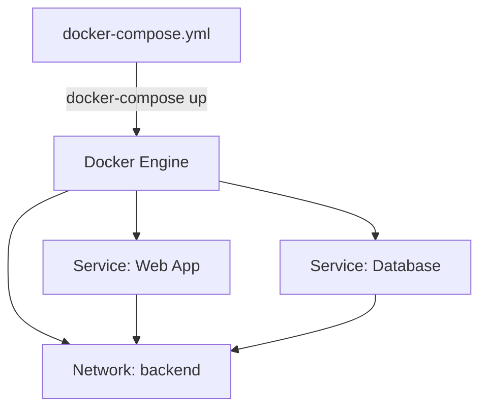

# 第 4 章：Docker Compose 與多容器編排

## 觀念講解 (Concepts)

### 1. 為什麼需要 Docker Compose？
當專案變得複雜時，手動輸入多條 `docker run` 指令既繁瑣又容易出錯。



#### 關係連結說明 (Link Meanings)
*   **A → B (YAML 到 Engine)**：**配置載入**。Docker Compose 工具讀取 YAML 檔案中的服務定義、網路與卷期配置，並將指令批次傳遞給 Docker Daemon。
*   **B → C/D (Engine 到 Service)**：**並行啟動**。Daemon 根據配置同時拉取映像檔並啟動多個容器實例，實現一鍵環境部署。
*   **B → E (Engine 到 Network)**：**自動化網路架設**。Daemon 建立專案專屬的隔離網路。
*   **C/D → E (Service 到 Network)**：**虛擬插拔**。代表各個服務容器加入 (Join) 專案網路，使其能夠透過服務名稱（DNS）互相發現並通訊。

- **YAML 文件定義**：你只需定義一份 `docker-compose.yml` 檔案，就能一鍵啟動多個容器 (例如應用程式、資料庫、快取)。
- **一致性**：確保團隊成員、開發環境與部署環境擁有完全相同的容器組合。

### 角色意義與關係運作 (Roles & Discovery)

Docker Compose 不僅僅是幫你一次啟動多個容器，它還扮演了「編排者 (Orchestrator)」的角色：

1.  **專案隔離 (Project Isolation)**：
    Docker Compose 會根據你的資料夾名稱作為專案前綴。這意味著你可以在同一台主機啟動兩套完全一樣的 Compose 專案，它們的容器與網路彼此獨立，互不干擾。
2.  **服務發現 (Service Discovery)**：
    這是最迷人的功能。在同一份 `docker-compose.yml` 定義的服務中，`webapp` 容器不需要知道 `database` 的 IP 位址。它只需要直接存取主機名 `database` (對，就是服務名稱)，Docker 內建的 DNS 就會自動幫你導向正確的容器。
3.  **依賴管理 (Dependency Management)**：
    透過 `depends_on` 指令，你可以決定容器的啟動順序。例如：資料庫沒啟動好，Web 應用程式先啟動可能會報錯，Compose 幫你解決了這個啟動先後順序的問題。

### 2. Docker Compose 的核心概念
- **Services (服務)**：專案中的一個單獨的容器 (例如 Web APP, Redis, MySQL)。
- **Networks (網路)**：Compose 會自動為每個專案建立一個專屬網路，容器之間可透過 **服務名稱** 直接互連，無需複雜的 IP 配置。
- **Volumes (卷期)**：定義資料持久化，確保資料在庫容器刪除後依然存在。

---

## 實作演練 (Implementation)

### 1. 建立 Web 伺服器與 Redis 快取的組合
建立一個專屬資料夾並準備 `docker-compose.yml`：

```yaml
version: '3.8' # YAML 版本 (現代開發建議使用 3.8 以上)

services:
  # 服務名稱 1：Web 應用
  webapp:
    image: node:18-alpine
    working_dir: /app
    ports:
      - "8080:3000" # 將容器 3000 映射到主機 8080
    volumes:
      - .:/app # 使用 Bind Mount 將本地程式碼同步到容器 (開發方便)
    command: npm start # 啟動命令
    depends_on:
      - database # 指定啟動順序 (先啟動資料庫)

  # 服務名稱 2：資料庫
  database:
    image: redis:alpine
    restart: always # 如果崩潰則自動重新啟動
    networks:
      - backend

networks:
  backend:
    driver: bridge
```

### 2. 管理 Docker Compose 專案

```bash
# 1. 啟動所有服務 (-d 背景執行)
docker-compose up -d

# 2. 查看專案內的容器狀態 (只會列出該專案相關的容器)
docker-compose ps

# 3. 停止並移除所有容器、網路與映像檔
docker-compose down

# 4. 針對單一服務進行重啟
docker-compose restart webapp

# 5. 查看日誌
docker-compose logs -f
```

### 3. 未來擴展
學會 Docker Compose 後，你就具備了從單機容器過度到叢集編排 (如 Kubernetes / Docker Swarm) 的基礎能力。

---
*Last updated: 2026-03-13 by SiaSia 🦞*
