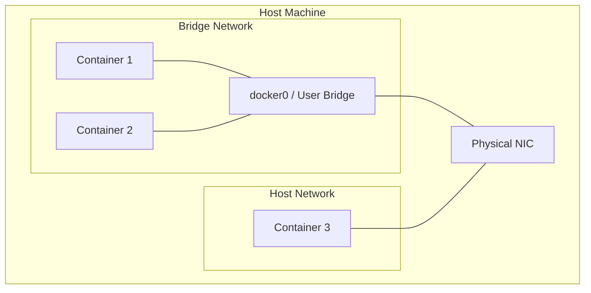
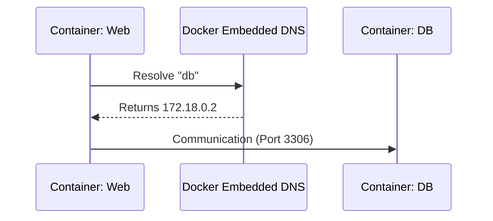

# 第 5 章：Docker 網路深度解析

## 觀念講解 (Concepts)

### 1. Docker 網路驅動程式 (Network Drivers)
Docker 提供了多種網路模式，適應不同的應用場景：



#### 關係連結說明 (Link Meanings)
*   **C1/C2 --- Bridge**：**虛擬連線 (veth pair)**。連結代表容器具備虛擬網路卡，並像插在交換機上一樣連接至 Docker 的虛擬網橋。
*   **Bridge --- NIC**：**網路位址轉換 (NAT)**。連結代表內部容器流量透過主機實體網路卡與外部通訊。
*   **C3 --- NIC**：**主機共用 (Host Shared)**。連結代表容器跳過虛擬層，直接佔用主機的 IP 與通訊埠空間。

### 2. 容器 DNS 解析 (Embedded DNS)
在使用者定義的網路 (User-defined Bridge) 中，Docker 會啟動內建的 DNS Server。



#### 互動流程說明 (Interaction Meanings)
*   **C1 → DNS**：**名稱查詢**。Web 容器不直接使用 IP，而是向 Docker Engine 的 DNS 服務詢問特定名稱對應的位址。
*   **DNS → C1**：**解析回傳**。Docker 內建資料庫回傳目前 DB 容器所在的私有 IP。
*   **C1 → C2**：**直接通訊**。一旦獲得 IP，Web 容器便能建立點對點的 TCP/UDP 連線，完成應用程式間的資料傳遞。

### 3. 通訊埠映射 (Port Mapping)
使用 `-p <Host Port>:<Container Port>` 指令。Docker 本質上是在主機的 iptables 中建立規則，將主機特定埠號的流量導向容器。

---

## 實作演練 (Implementation)

### 1. 自定義網路實戰
使用預設網路無法透過名稱通訊，因此我們應該建立自己的網路：

```bash
# 1. 建立一個自定義橋接網路
docker network create my-app-net

# 2. 啟動兩個容器並加入同一個網路
docker run -d --name db --network my-app-net redis
docker run -it --name tool --network my-app-net alpine sh

# 3. 在 tool 容器內測試 DNS 解析
# / # ping db
# 預期結果：成功 ping 通，顯示 db 的內部 IP
```

### 2. 檢視網路細節

```bash
# 列出所有網路
docker network ls

# 查看特定網路中掛載了哪些容器與其 IP
docker network inspect my-app-net

# 將已執行的容器連接到新網路
docker network connect bridge db
```

### 3. 清理網路資源

```bash
# 斷開容器與網路的連結
docker network disconnect my-app-net db

# 移除網路
docker network rm my-app-net
```

---
*Last updated: 2026-03-13 by SiaSia 🦞*
