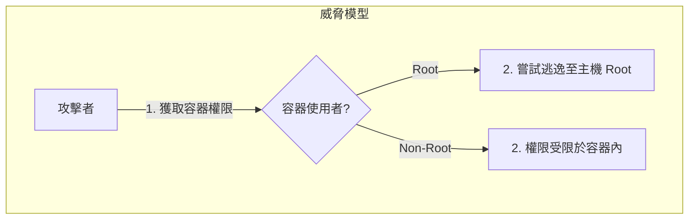

# 第 7 章：Docker 安全與最佳實踐

## 觀念講解 (Concepts)

### 1. 最小化基礎映像檔 (Minimal Base Images)
映像檔體積越大，攻擊面也越大。優先選擇 Alpine 或 Distroless 等體積極小的版本。
- **Alpine**：體積約 5MB，內含基礎 shell。
- **Distroless**：完全沒有 shell 與基礎工具，安全性最高。

### 2. 減少分層數量
Dockerfile 中的每一條指令 (RUN, COPY) 都會產生一個層。應該合併相關的指令以減少層數。
- **不推薦**：多次 RUN 指令。
- **推薦**：使用 `&&` 和 `\` 將指令合併在一個 RUN 裡。

### 3. 使用非根使用者 (Non-root Users)
預設情況下，Docker 會以 root 使用者權限啟動容器。如果容器被入侵，攻擊者將直接擁有 root 權限。



#### 安全防護說明 (Security Path Meanings)
*   **A → B (攻擊路徑)**：**初步滲透**。攻擊者利用應用程式漏洞獲取容器終端執行權。
*   **B → C (高風險路徑)**：**權限擴張**。若容器以 Root 執行，攻擊者可利用核心漏洞嘗試「容器逃逸」，直接控制宿主機。
*   **B → D (受控路徑)**：**權限限制**。若容器以非根使用者 (Non-Root) 執行，即便被滲透，其操作範圍也被限制在極小的系統調用與檔案存取權限內，保護主機不受波及。

應該在 Dockerfile 中使用 `USER` 指令。

### 4. 避免使用 "latest" 標籤
"latest" 標籤是不可預知的，映像檔更新後可能導致舊程式崩潰。應明確指定具體的版本號 (如 nginx:1.25.3)。

---

## 實作演練 (Implementation)

### 1. 安全化 Dockerfile 範例
這是一個經過安全性優化的 Node.js 應用的 Dockerfile：

```dockerfile
# 1. 指定明確的版本 (不要用 latest)
FROM node:18-alpine

# 2. 安裝必要依賴，並在同一個 RUN 層清理緩存以減小體積
RUN apk update && apk add --no-cache git && rm -rf /var/cache/apk/*

# 3. 指定工作目錄
WORKDIR /usr/src/app

# 4. 複製依賴文件 (package.json)
COPY package.json package-lock.json ./

# 5. 僅安裝生產環境所需的依賴 (npm ci 更快更精確)
RUN npm ci --only=production

# 6. 複製其餘所有源代碼
COPY . .

# 7. 建立一個非 root 的系統使用者 (node_user)
RUN addgroup -S node_group && adduser -S node_user -G node_group
# 將檔案擁有權轉移給該使用者
RUN chown -R node_user:node_group /usr/src/app

# 8. 以該使用者權限啟動 (重要安全防線！)
USER node_user

EXPOSE 3000
CMD ["node", "index.js"]
```

### 2. 掃描映像檔安全漏洞 (Trivy 實戰)
使用工具來掃描你的映像檔是否存在已知的安全威脅：

```bash
# 安裝並執行掃描工具 Trivy (需另行安裝)
# 這裡僅顯示用法示例：
trivy image my-app-v1.0

# 預期結果：顯示該映像檔中的 CVE 漏洞清單與嚴重等級度。
```

### 3. 設定資源限制 (Resource Constraints)
防止單個容器耗盡主機的所有資源 (CPU/Memory)：

```bash
# 限制容器最多使用 512MB 記憶體與 0.5 核心 CPU
docker run -d --name limited-app --memory="512m" --cpus="0.5" nginx
```

---
*Last updated: 2026-03-13 by SiaSia 🦞*
