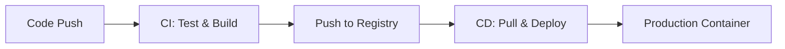

# 第 8 章：Docker 與 CI/CD 自動化工作流

## 觀念講解 (Concepts)

### 1. 什麼是 CI/CD？
CI/CD (持續整合與持續部署) 是現代開發的核心架構。



#### 工作流連結說明 (Workflow Link Meanings)
*   **A → B (代碼推送至整合)**：**觸發機制 (Trigger)**。開發者提交代碼變更，自動引發雲端 Runner 啟動測試與建構腳本。
*   **B → C (整合至倉庫)**：**成果封存 (Artifact)**。將通過品質檢查的代碼包裝成不可變的映像檔 (Image)，確保測試環境與生產環境的一致性。
*   **C → D (倉庫至部署)**：**遠端同步 (Sync)**。伺服器端感知到新版本映像檔，主動發起下載請求。
*   **D → E (部署至生產)**：**滾動更新 (Update)**。Daemon 根據新映像檔重新啟動容器實例，完成服務的無縫切換或升級。

- **CI (Continuous Integration)**：每次代碼提交後，自動執行測試並建立映像檔。
- **CD (Continuous Deployment)**：將通過測試的映像檔自動推送到 Registry 並部署到伺服器。

### 2. GitHub Actions 與 Docker Registry
GitHub Actions 提供了強大的自動化流程，而 Docker Hub (或 GitHub Packages) 則是存放映像檔的中心倉庫。
1. **GitHub Action**：觸發 CI 流程。
2. **Build**：執行 `docker build` 指令。
3. **Push**：將建立好的映像檔上傳到 Docker Registry。

### 3. 多階段建立 (Multi-stage Builds)
這是 CI 流程中最推薦的技術。你可以將編譯環境與執行環境分開，從而大幅減小生產環境映像檔的體積。

---

## 實作演練 (Implementation)

### 1. 多階段建立 Dockerfile 示例 (Golang)

```dockerfile
# 階段一：編譯 (Build Stage)
FROM golang:1.21-alpine AS builder
WORKDIR /app
COPY . .
RUN go build -o main .

# 階段二：生產環境 (Final Production Stage)
# 我們不需要 golang 編譯工具，只需要核心執行檔！
FROM alpine:latest
WORKDIR /root/
# 只從 builder 階段複製編譯後的二進位檔案
COPY --from=builder /app/main .
EXPOSE 8080
CMD ["./main"]
```

### 2. GitHub Actions 自動化腳本 (.github/workflows/docker.yml)

```yaml
name: Build and Push Docker Image

on:
  push:
    branches: [ "main" ] # 當 main 分支有 push 時觸發

jobs:
  build:
    runs-on: ubuntu-latest
    steps:
    - uses: actions/checkout@v3

    # 1. 登入 Docker Hub
    - name: Login to Docker Hub
      uses: docker/login-action@v2
      with:
        username: ${{ secrets.DOCKERHUB_USERNAME }}
        password: ${{ secrets.DOCKERHUB_TOKEN }}

    # 2. 建立並推送到 Docker Hub
    - name: Build and push
      uses: docker/build-push-action@v4
      with:
        push: true
        tags: user/my-app:latest
```

### 3. 自動化流程驗證

```bash
# 1. 將程式碼推送到 GitHub
git add .
git commit -m "ci: add GitHub Actions workflow"
git push origin main

# 2. 觀察 GitHub Actions 頁面
# 預期結果：看到綠色勾勾，並在 Docker Hub 看到新上傳的映像檔。
```

---
*Last updated: 2026-03-13 by SiaSia 🦞*
